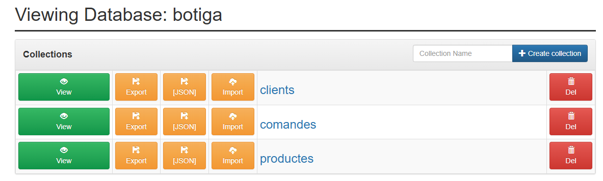

1. Quina és la diferència entre docker run i docker compose up?

-docker run se utiliza para crear e iniciar un único contenedor de forma individual pasando todos los parámetros por línea de comandos.

-docker compose up es una herramienta de orquestación que permite levantar múltiples servicios (como nuestra BD y su interfaz web) simultáneamente usando un único archivo de configuración YAML.

2. Per a què serveix la instrucció depends_on? Garanteix que el servei estigui completament operatiu?

-Sirve para definir el orden de inicio de los contenedores (por ejemplo, que Mongo Express no intente arrancar antes que la base de datos).

-No garantiza que el servicio esté operativo; solo indica que el contenedor principal se ha iniciado. La base de datos podría tardar unos segundos más en estar lista para recibir conexiones reales.

3. Diferència entre xarxa bridge per defecte i xarxa personalitzada a Docker Compose.

-La red personalizada (como nuestra xarxa-botiga) permite que los contenedores se comuniquen entre ellos usando sus nombres de servicio (DNS interno) y ofrece un aislamiento mucho mayor y más seguro que la red bridge por defecto.

1. Què passaria si no definíssim cap volum al docker-compose.yml?
Las dades se guardarían solo en la memoria temporal del contenedor. Si el contenedor se borra o se reinicia, todos los datos se perderían para siempre.

2. Diferència entre volum named i bind mount:
Un bind mount (como el que usamos con ./data) mapea una carpeta de nuestro ordenador directamente al contenedor. Un named volume es gestionado internamente por Docker en una ruta oculta.

3. Diferència entre estratègia embedding i referència:
Embedding guarda los datos relacionados dentro del mismo documento (rápido para leer). Referència guarda un identificador (como el email o un ID) para apuntar a otra colección (mejor para evitar duplicados).

4. Estratègia en la col·lecció comandes:
He utilizado Referencia. Guardo el client_email en la comanda para saber quién hizo la compra sin tener que copiar todos los datos del cliente cada vez.

